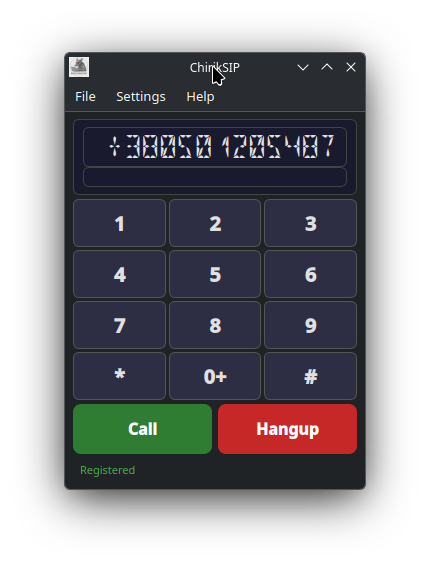

# ChirikSIP

A minimal SIP client for KDE Plasma and Windows, built with Qt6 and PJSIP.



Детальніші скріншоти див. у [screenshots/README.md](screenshots/README.md)

## Features

- SIP registration with digest authentication
- Outgoing calls (dial by number or SIP URI)
- Incoming calls with ringtone and Answer button
- Audio bridge via PortAudio (works with PipeWire/PulseAudio)
- Phone-style numpad UI (123456789*0#)
- LCD display with Segment16A digital font
- Caller name display with scrolling text
- Setup wizard on first launch
- Settings in separate dialog (Ctrl+,)
- Auto re-registration when settings change
- System tray: minimize to tray, only Ctrl+Q exits
- Incoming call popup when minimized
- Settings persistence (Windows: %APPDATA%/chiriksip/, Linux: ~/.config/chiriksip/)
- Auto-registration on startup
- Keyboard support: 0-9, *, #, +, Enter, Escape, Backspace
- G.711 A-law (PCMA) and G.711 u-law (PCMU) codecs only
- Windows cross-compilation support (MinGW32/64)
- Improved stability: fixed null pointer crashes when no audio device, race conditions in PortAudio threads, data races in ringtone playback, data races in AudioBridge shared buffers (memory_order), PortAudioManager refcount leak, and m_incomingCallId not reset on remote hangup
- Config file permissions restricted to owner-only (password security)
- Setup wizard: Enter key triggers Next/Finish button, focus moves to the active input field

## Build Dependencies

| Package | Purpose |
|---------|---------|
| `cmake >= 3.20` | Build system |
| `gcc-c++` | C++17 compiler |
| `qt6-qtbase-devel` | Qt6 Core, Widgets |
| `pkgconfig(libpjproject)` | PJSIP SIP stack |
| `portaudio-devel` | Audio I/O |
| `desktop-file-utils` | .desktop file validation |
| `hicolor-icon-theme` | Icon installation |

## Runtime Dependencies

| Package | Purpose |
|---------|---------|
| `qt6-qtbase` | Qt6 runtime |
| `qt6-qtbase-gui` | Qt6 GUI |
| `pjproject` | SIP/audio stack |
| `portaudio` | Audio device access |
| `hicolor-icon-theme` | System icons |

## Build from Source

```bash
mkdir build && cd build
cmake ..
cmake --build .
```

## Install

```bash
cmake --install build
```

## RPM Build

Source RPM and binary RPM:

```bash
# Create source tarball
cd /path/to/ChirikSIP
VERSION=$(grep 'Version:' packaging/chiriksip.spec | awk '{print $2}')
tar czf ~/rpmbuild/SOURCES/chiriksip-${VERSION}.tar.gz \
    --transform "s,^,chiriksip-${VERSION}/," \
    --exclude build --exclude build-win32 --exclude build-win64 \
    --exclude dist-win32 --exclude dist-win64 \
    --exclude .git --exclude .gitignore --exclude .mimocode \
    .

# Build source RPM only (binary RPM requires Fedora with all deps)
rpmbuild -bs packaging/chiriksip.spec

# On Fedora, build both source and binary RPM:
# rpmbuild -ba packaging/chiriksip.spec
```

## Cross-Compilation (Windows)

See [CROSS-COMPILE.md](CROSS-COMPILE.md) for MinGW cross-compilation via Docker.

## CI/CD

GitHub Actions workflows:

| Workflow | Trigger | Platform | Output |
|----------|---------|----------|--------|
| `build-linux.yml` | Push/PR to `main`, `dev-ghaction` | Fedora 44 (CI) / Ubuntu (CI) | src.rpm, cmake build |
| `build-windows.yml` | Push/PR to `main`, `dev-ghaction` | Windows (MSYS2) | .exe + DLLs |

Workflows run automatically when changes touch `src/`, `packaging/`, `CMakeLists.txt`, or `resources/`.

## Usage

1. Launch `chiriksip`
2. Open **Settings > Settings** (Ctrl+,) and enter SIP server, username, password
3. Click **Register** (or it registers automatically if settings are saved)
4. Dial a number using the numpad and press **Call**
5. For incoming calls, press **Answer**

## Keyboard Shortcuts

| Key | Action |
|-----|--------|
| 0-9 | Input digit |
| * | Input asterisk |
| # | Input hash |
| + | Input plus |
| Enter | Make call / Answer |
| Escape | End call |
| Backspace | Delete last digit |
| Ctrl+, | Open Settings |

## Button Behavior

| Button | Short Press | Long Press |
|--------|-------------|------------|
| Hangup | Delete last digit / End call | Clear all / End call |
| 0+ | Insert "0" | Insert "+" |

## License

MIT
