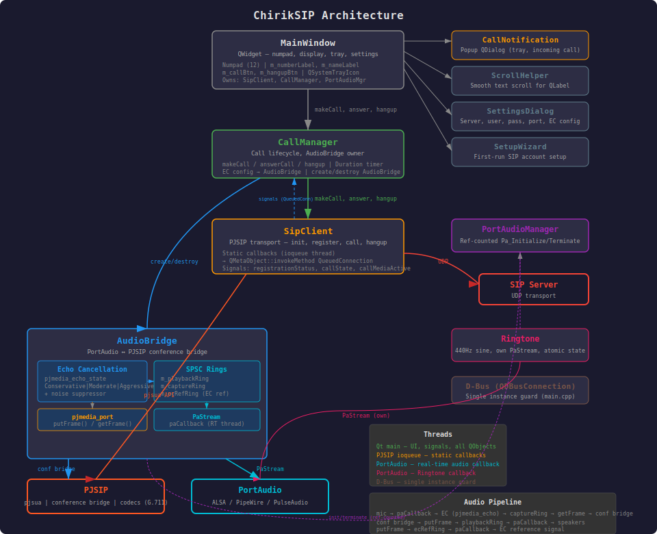

# ChirikSIP

A minimal SIP client for KDE Plasma, built with Qt6 and PJSIP.


Детальніші скріншоти див. у [screenshots/README.md](screenshots/README.md)

## Features

- SIP registration with digest authentication
- Outgoing calls (dial by number or SIP URI)
- Incoming calls with ringtone and Answer button
- Audio bridge via PortAudio (works with PipeWire/PulseAudio)
- Echo cancellation via pjmedia_echo (configurable aggressiveness)
- Phone-style numpad UI (123456789*0#)
- LCD display with Segment16A digital font
- Caller name display with scrolling text
- Setup wizard on first launch
- Settings in separate dialog (Ctrl+,)
- Configurable SIP port (default: 0 = auto-select)
- Status bar shows current transport port (e.g. UDP:50600)
- Call duration timer (HH:MM:SS) centered in status bar during calls
- Auto re-registration when settings change
- System tray: minimize to tray, only Ctrl+Q exits
- Incoming call popup when minimized
- Settings persistence (~/.config/chiriksip/)
- Auto-registration on startup
- Keyboard support: 0-9, *, #, +, Enter, Escape, Backspace
- G.711 A-law (PCMA) and G.711 u-law (PCMU) codecs only
- Single instance: only one ChirikSIP can run at a time
- Improved stability: fixed null pointer crashes when no audio device, race conditions in PortAudio threads, data races in ringtone playback, data races in AudioBridge shared buffers (memory_order), PortAudioManager refcount leak, and m_incomingCallId not reset on remote hangup
- Config file permissions restricted to owner-only (password security)
- Setup wizard: Enter key triggers Next/Finish button, focus moves to the active input field

## Architecture



```
┌──────────────┐     ┌──────────────┐     ┌──────────────┐
│  MainWindow  │────►│ CallManager  │────►│  SipClient   │
│  (Qt UI)     │     │ (lifecycle)  │     │  (PJSIP)     │
└──────────────┘     └──────┬───────┘     └──────┬───────┘
                            │                    │
                     ┌──────▼───────┐     ┌──────▼───────┐
                     │ AudioBridge  │     │   PJSIP      │
                     │ (PortAudio)  │     │  conference  │
                     │  ┌─────────┐ │     │   bridge     │
                     │  │EC (AEC) │ │     └──────────────┘
                     │  │×3 rings │ │
                     │  └─────────┘ │     ┌──────────────┐
                     └──────────────┘     │  Ringtone    │
                                          │ (440Hz sine) │
                     ┌──────────────┐     └──────────────┘
                     │PortAudioMgr  │
                     │(ref-counted) │
                     └──────────────┘
```

## Build Dependencies

| Package | Purpose |
|---------|---------|
| `cmake >= 3.20` | Build system |
| `gcc-c++` | C++17 compiler |
| `qt6-qtbase-devel` | Qt6 Core, Widgets |
| `pkgconfig(libpjproject)` | PJSIP SIP stack |
| `portaudio-devel` | Audio I/O |
| `desktop-file-utils` | .desktop file validation |
| `hicolor-icon-theme` | Icon installation |

## Runtime Dependencies

| Package | Purpose |
|---------|---------|
| `qt6-qtbase` | Qt6 runtime |
| `qt6-qtbase-gui` | Qt6 GUI |
| `pjproject` | SIP/audio stack |
| `portaudio` | Audio device access |
| `hicolor-icon-theme` | System icons |

## Build from Source

```bash
mkdir build && cd build
cmake ..
cmake --build .
```

## Install

```bash
cmake --install build
```

## RPM Build

### Local Build (Fedora)

```bash
# Create source tarball
cd /path/to/ChirikSIP
VERSION=$(grep 'Version:' packaging/chirik.spec | awk '{print $2}')
tar czf ~/rpmbuild/SOURCES/chiriksip-${VERSION}.tar.gz \
    --transform "s,^,chiriksip-${VERSION}/," \
    --exclude build --exclude build-win32 --exclude build-win64 \
    --exclude dist-win32 --exclude dist-win64 \
    --exclude .git --exclude .gitignore --exclude .mimocode \
    .

# Build source RPM only (binary RPM requires Fedora with all deps)
rpmbuild -bs packaging/chiriksip.spec

# On Fedora, build both source and binary RPM:
# rpmbuild -ba packaging/chiriksip.spec
```

### Container Build (podman/docker)

Build RPM packages in containers for Fedora 36+ without installing dependencies on your host system.

**Prerequisites:** podman or docker installed

```bash
# Build for a single Fedora version
./build-rpm.sh "42"

# Build for multiple versions (matrix build)
./build-rpm.sh "40 41 42"

# Build with rpmfusion repositories (for older Fedora or additional codecs)
./build-rpm.sh --rpmfusion "36 37 38"

# Force rebuild without cache
./build-rpm.sh --force "42"
```

Artifacts are saved to `build/rpms/`:
- `chiriksip-*.rpm` — main package
- `chiriksip-debuginfo-*.rpm` — debug symbols
- `chiriksip-debugsource-*.rpm` — debug source
- `chiriksip-*.src.rpm` — source RPM

**Options:**
- `--rpmfusion` — enable rpmfusion-free and rpmfusion-nonfree repositories
- `--force` — rebuild without Docker/podman cache
- `-h, --help` — show usage information

## DEB Build

### Container Build (podman/docker)

Build .deb packages in containers for Ubuntu 22.04 LTS and 24.04 LTS without installing dependencies on your host system.

**Supported versions:** Ubuntu 22.04 LTS (Jammy), Ubuntu 24.04 LTS (Noble)

**Prerequisites:** podman or docker installed

```bash
# Build for Ubuntu 22.04
./build-deb.sh "22.04"

# Build for Ubuntu 24.04
./build-deb.sh "24.04"

# Build for both LTS versions
./build-deb.sh "22.04 24.04"

# Force rebuild without cache
./build-deb.sh --force "24.04"
```

Artifacts are saved to `build/debs/`:
- `chiriksip_*.deb` — main package
- `chiriksip_*.changes` — changes file
- `chiriksip_*.buildinfo` — build info

**Options:**
- `--force` — rebuild without Docker/podman cache
- `-h, --help` — show usage information

## Flatpak Build

### Local Build

Build Flatpak package locally using flatpak-builder.

**Prerequisites:** flatpak and flatpak-builder installed

```bash
# Build and install
./build-flatpak.sh

# Or manually
flatpak-builder --force-clean --install-deps-from=flathub --repo=repo builddir com.github.chirik.ChirikSIP.yml
flatpak install --user repo com.github.chirik.ChirikSIP

# Run
flatpak run com.github.chirik.ChirikSIP
```

### From Flathub

```bash
flatpak install flathub com.github.chirik.ChirikSIP
flatpak run com.github.chirik.ChirikSIP
```

## CI/CD

GitHub Actions workflows:

| Workflow | Trigger | Platform | Output |
|----------|---------|----------|--------|
| `build-rpm.yml` | Push/PR to `main` | Ubuntu (podman) | RPM for Fedora 44 (x86_64 + src) |
| `build-deb.yml` | Push/PR to `main` | Ubuntu (podman) | DEB for Ubuntu 24.04 |
| `build-flatpak.yml` | Push/PR to `main` | Ubuntu (CI) | Flatpak bundle + sources |

Workflows run automatically when changes touch `src/`, `packaging/`, `debian/`, `CMakeLists.txt`, or `resources/`. All build artifacts are published to GitHub releases on push to `main`.

## Usage

1. Launch `chiriksip`
2. Open **Settings > Settings** (Ctrl+,) and enter SIP server, username, password
3. Click **Register** (or it registers automatically if settings are saved)
4. Dial a number using the numpad and press **Call**
5. For incoming calls, press **Answer**

## Keyboard Shortcuts

| Key | Action |
|-----|--------|
| 0-9 | Input digit |
| * | Input asterisk |
| # | Input hash |
| + | Input plus |
| Enter | Make call / Answer |
| Escape | End call |
| Backspace | Delete last digit |
| Ctrl+, | Open Settings |

## Button Behavior

| Button | Short Press | Long Press |
|--------|-------------|------------|
| Hangup | Delete last digit / End call | Clear all / End call |
| 0+ | Insert "0" | Insert "+" |

## License

MIT
