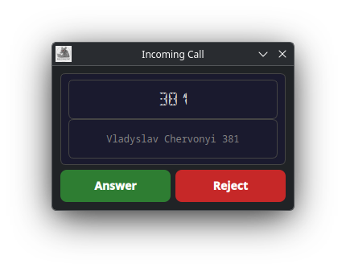
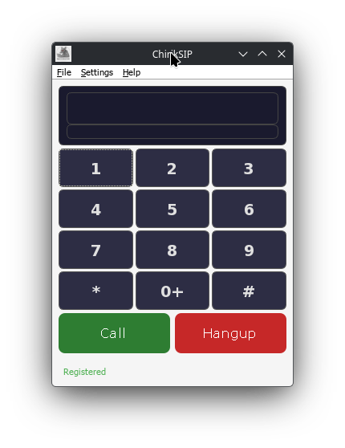
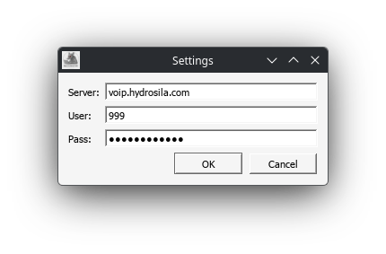
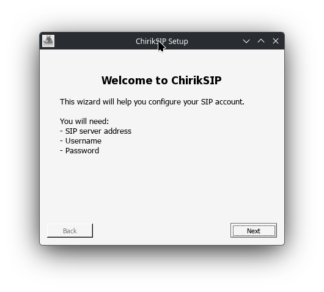
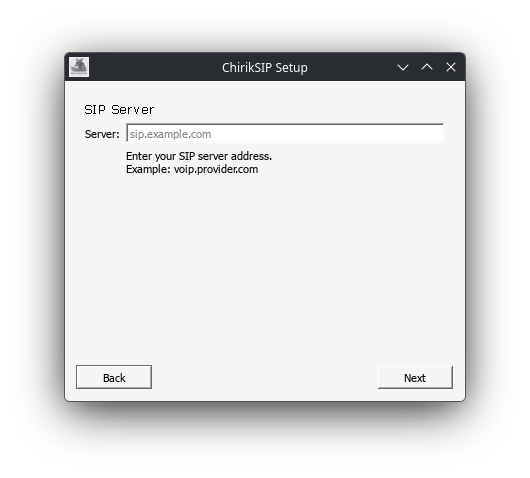
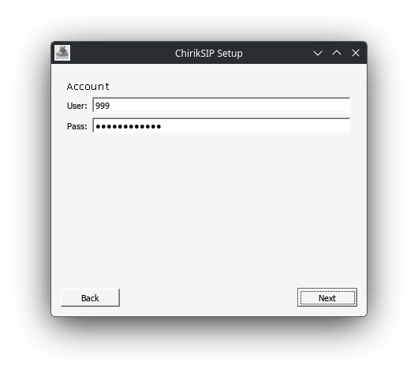

# Screenshots

## Linux

### Головне вікно

Основний інтерфейс ChirikSIP на KDE Plasma. LCD-дисплей з шрифтом Segment16A, кнопка Call/Hangup, нумпад.

### Сповіщення про вхідний дзвінок

Спливаюче вікно при входящому виклику, коли додаток згорнуто в трей.

## Windows (Wine)

### Головне вікно

ChirikSIP працює на Windows через Wine. Нумпад, кнопки Call/Hangup, іконка в треї.

### Налаштування

Діалог налаштувань SIP-аккаунту: сервер, логін, пароль.

### Майстер налаштування

Крок 1: Привітання.

Крок 2: Введення SIP-сервера.

Крок 3: Налаштування акаунту.
